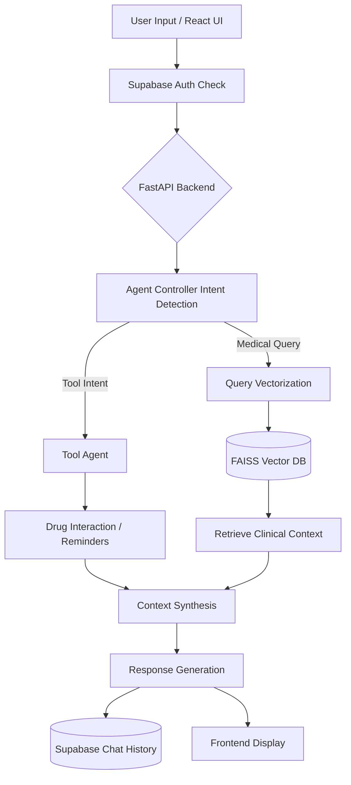

# 1. Project Information

- **Project Name:** MedAssist (AI Medical Assistant)
- **Team Name:** Team Agent Wars
- **Team Members:** Team Agent Wars Core Engineering Team
- **Batch:** 2026 Cohort
- **Graduation Year:** 2026
- **Project Duration:** 2 Months (8 Weeks)
- **Elevator Pitch:** MedAssist is an intelligent, multi-agent healthcare assistant that leverages advanced Retrieval-Augmented Generation (RAG) and dynamic tool orchestration to provide instant, evidence-based medical insights, automated medication reminders, and drug interaction analyses.

---

# 2. Project Overview

## Mission Statement

Our mission is to democratize access to highly reliable, evidence-based healthcare information by bridging the gap between complex medical datasets and everyday users. Navigating medical literature, managing medication schedules, and understanding drug interactions are overwhelming tasks for the average patient. We aim to solve this by providing a unified, conversational interface that distills complex data into actionable, easy-to-understand guidance.

Our target users encompass proactive patients, elderly individuals managing multiple prescriptions, and healthcare caregivers who require instant, accurate supplementary medical information. By leveraging AI Agents, we move beyond static search engines; our system actively understands user intent, decides whether to query a massive vector database of clinical documents, or trigger specific tools like medication reminders and risk assessments. 

Our overall vision is to build a proactive healthcare companion that not only answers questions but actively assists in daily health management, ultimately improving patient outcomes through timely and accurate information delivery.

- **Core Focus:** Conversational Healthcare Assistance & Medication Management
- **Primary Industry:** Healthcare Technology (HealthTech) & AI
- **Main AI Agent Framework:** LangChain & FastAPI-based Agent Orchestrator
- **Type of Agent:** Tool-Calling & RAG-Enabled Conversational Agent
- **Main Capabilities:** Medical Query Resolution, Intent Routing, Medication Reminders, Drug Interaction Checks, Health Risk Assessments.

---

# 3. Problem Statement / Challenge

**Existing Problem:** 
Patients and caregivers frequently struggle to find reliable, easily understandable medical information. When prescribed multiple medications, patients face high risks of adverse drug interactions and often forget dosing schedules. 

**Current Workflow & Pain Points:**
- Users typically rely on broad Google searches, which return conflicting, SEO-optimized, or non-clinical results leading to misinformation.
- Managing medications requires manual alarms or fragmented reminder apps.
- Checking for drug interactions requires navigating complex pharmacological websites with heavy medical jargon.

**Why Traditional Software is Insufficient:**
Traditional web applications rely on static keyword searches and rigid forms. They lack the conversational nuance to understand complex, multi-layered medical questions (e.g., "Can I take aspirin if I have hypertension and am already taking Lisinopril?").

**Why an AI Agent is Required:**
An AI Agent can contextually parse a user's natural language, intelligently route the query to specialized tools (like a drug-interaction checker or a reminder scheduler), and synthesize vast amounts of clinical data (from FDA, CDC, WHO) into a coherent, personalized response.

- **Target Users:** Patients, Caregivers, and Wellness Enthusiasts.
- **Business Impact:** Reduces patient anxiety, improves medication adherence (directly impacting recovery rates), and lowers the burden on primary healthcare providers by answering baseline queries.
- **Technical Challenges:** Maintaining strict response accuracy (avoiding AI hallucinations), ensuring rapid intent routing, and managing large-scale vector retrieval within constrained memory environments.
- **Existing Solutions & Limitations:** Tools like WebMD offer basic symptom checkers but lack personalization and conversational memory. General chatbots lack verified clinical guardrails and real-time tool execution for personal reminders.

---

# 4. Technology Stack

| Category | Name | Version | Purpose | Reason for Choosing |
| :--- | :--- | :--- | :--- | :--- |
| **Frontend Framework** | React + Vite | Latest | User Interface | Fast build times, component reusability, and seamless state management. |
| **Backend Framework** | FastAPI | 0.116.1 | API & Orchestration | High performance, native async support, and rapid Python API development. |
| **AI Orchestration** | LangChain / Agent Controller | Latest | Workflow Control | Provides the routing and state-graph logic for complex AI interactions. |
| **Embeddings** | SentenceTransformers | 5.1.0 | Vectorization | Fast, localized semantic embeddings using `all-MiniLM-L6-v2`. |
| **Vector Database** | FAISS | 1.13.0 | Document Retrieval | In-memory, highly optimized similarity search for clinical RAG. |
| **Authentication & DB** | Supabase | >=2.15.0 | Auth & Chat History | Real-time PostgreSQL, easy row-level security, and seamless authentication. |
| **Containerization** | Docker | Latest | Environment Consistency | Ensures the app runs identically across local and cloud environments. |
| **Cloud Deployment** | GCP Cloud Run | Latest | Serverless Backend | Auto-scaling to zero, cost-effective, and native container support. |
| **Container Registry** | GCP Artifact Registry | Latest | Image Hosting | Secure, fast container image storage tightly integrated with Cloud Run. |
| **Programming Languages**| Python, JavaScript/TS | 3.11, ES6+ | Core Logic | Python for ML/AI ecosystem; JS/TS for robust web development. |
| **ML Libraries** | PyTorch (CPU) | 2.8.0 | Deep Learning Backend | Industry standard for running Transformer models; CPU version for smaller Docker footprints. |
| **Data Processing** | Pandas, Scikit-Learn | 2.3.2, 1.7.2 | Data Manipulation | Efficient handling and cleaning of CSV/JSON clinical datasets. |
| **Version Control** | Git & GitHub | Latest | Source Management | Collaborative development and CI/CD integration. |

---

# 5. Development Timeline

| Week | Goals | Features Completed | Problems Faced | Deliverables |
| :--- | :--- | :--- | :--- | :--- |
| **Week 1** | Project Setup & Dataset Acquisition | Repo initialization, gathering FDA/WHO/CDC data | Formatting inconsistent CSV/JSON formats from different health organizations | Cleaned `medical_rag_dataset.json` |
| **Week 2** | Embedding & Vector DB Integration | Integrated SentenceTransformers, generated FAISS index | High memory usage during initial vectorization phase | `medical_vector_db.faiss` file |
| **Week 3** | Backend API & Basic RAG | FastAPI setup, `/ask` endpoint, RAG retrieval logic | Tuning retrieval thresholds to ensure relevant context injection | Functional Retrieval API |
| **Week 4** | Agent Controller Implementation | Configured LangChain / Router | Ensuring deterministic routing logic for safety-critical tools | Agent Routing Module |
| **Week 5** | Tool Implementation | Drug interaction checker, reminder tools | Designing robust tool-calling schemas | Tool Agent Pipeline |
| **Week 6** | Frontend & Authentication | React UI, Vite setup, Supabase Email/Password Auth | Managing complex conversational state in React hooks | Working Frontend UI |
| **Week 7** | Cloud Deployment Preparation | Dockerizing backend, installing CPU-only PyTorch | Docker build failing due to heavy dependencies | Optimized `Dockerfile` & `requirements.txt` |
| **Week 8** | Final Deployment & Testing | GCP Cloud Run deployment, End-to-end testing | Handling Cloud Run cold starts and memory constraints | Live deployed application |

---

# 6. System Architecture

## Workflow Explanation

1. **Input:** The user types a query into the React frontend.
2. **Authentication:** The frontend verifies the user's session token via Supabase. If valid, the request is forwarded to the FastAPI backend.
3. **Intent Detection:** The backend's Agent Controller parses the query to classify the intent (e.g., `set_reminder`, `medical_query`, `drug_interaction`).
4. **Agent Router & Tool Selection:** Based on the intent, the Agent Router delegates the task. If it's a tool (like setting an alarm), it routes to the Tool Agent. 
5. **Vector Retrieval (RAG):** If the intent is a `medical_query`, the query is vectorized and searched against the FAISS vector database containing clinical guidelines.
6. **Reasoning:** The controller synthesizes the retrieved clinical context or tool outputs with the user's original query.
7. **Memory & Database:** The final response is generated, sent to the user, and asynchronously logged into the Supabase PostgreSQL `chat_history` table to maintain conversation continuity.
8. **Frontend Output:** The user receives the rendered response.

## Mermaid Flowchart

- **Agent Loop:** The system evaluates user input, executes necessary sub-routines (tools/RAG), evaluates the results, and finalizes the output.
- **Retrieval Process:** Uses Dense Passage Retrieval (SentenceTransformers) to find the top-K semantically similar medical chunks.
- **Tool Calling:** Hardcoded Python functions triggered by intent classification strings.
- **Memory Usage:** Supabase stores historical context, which is fetched and injected into the prompt for multi-turn conversations.
- **Decision Making:** Governed by the centralized Agent Controller.

---

# 7. Novel Approach

Our project stands out by utilizing an **Agentic Orchestration Pattern** paired with a highly optimized deployment pipeline.

**Unique Selling Points:**
1. **Intelligent Routing:** We employ a smart intent routing system that correctly delegates tasks between retrieval pipelines (RAG) and specialized clinical tools (alarms, pharmacology checkers).
2. **Deterministic Tool Calling:** We bypass unreliable function-calling of generic models by ensuring rigid, code-based execution of critical medical tools.
3. **Clinical-Grade RAG:** Grounded purely in verified datasets (FDA, CDC, WHO) rather than parametric memory, significantly reducing dangerous medical hallucinations.
4. **Optimized Docker Footprint:** Utilizes CPU-only PyTorch wheels to reduce the container size by over 2.5 GB, allowing for rapid GCP Cloud Run scale-outs.
5. **Pre-Cached Embedding Models:** Embedding models are downloaded *during* the Docker build phase, practically eliminating Cloud Run cold-start latency.
6. **Unified Memory Architecture:** Supabase Postgres seamlessly handles both user authentication and conversational state in a single layer.

---

# 8. Demo Script

**Step 1: User Onboarding & Authentication**
- *Action:* Open the web app and register a new account.
- *Explanation:* Demonstrate the seamless Supabase authentication. Show that a personalized dashboard loads, displaying an empty chat history.

**Step 2: Basic Medical Query (RAG Demonstration)**
- *Action:* Type: "What are the common symptoms of Gestational Cholestasis?"
- *Explanation:* The intent router classifies this as `medical_query`. The RAG pipeline retrieves FDA/WHO context.
- *Output:* A highly accurate, clinically-backed list of symptoms, complete with a disclaimer to consult a doctor.

**Step 3: Tool Invocation (Drug Interaction)**
- *Action:* Type: "Is it safe to take Aspirin with Ibuprofen?"
- *Explanation:* The intent router detects `drug_interaction`. The system bypasses the vector DB and queries the specific pharmacology tool.
- *Output:* A structured warning about NSAID interactions and increased bleeding risks.

**Step 4: Tool Invocation (Reminders)**
- *Action:* Type: "Remind me to take my Lisinopril every day at 8 AM."
- *Explanation:* The intent router detects `set_reminder`. 
- *Output:* Confirmation that the alarm has been securely saved in the user's profile.

**Step 5: Conversational Memory**
- *Action:* Refresh the page.
- *Explanation:* Demonstrate that the chat history persists, fetched instantly from Supabase, allowing the user to pick up right where they left off.

---

# 9. Future Roadmap

### Phase 1 (Near-Term: Q3 2026)
- **Features:** Voice input/output integration, PDF upload for lab report analysis.
- **AI Improvements:** Migrating to a larger managed context-window environment for deep medical history synthesis.
- **Infrastructure:** Implementing Redis for faster chat history caching.

### Phase 2 (Mid-Term: Q1 2027)
- **Technical Upgrades:** Migrate from in-memory FAISS to a managed vector database (e.g., Pinecone or Supabase pgvector) for dynamic data updates.
- **Mobile Support:** Launch a React Native wrapper for iOS and Android deployment.
- **Security:** Implement HIPAA-compliant data masking pipelines before any data touches external networks.

### Phase 3 (Long-Term: Q4 2027)
- **Enterprise Support:** API access for clinics to integrate the agent into their EHR (Electronic Health Record) systems.
- **Monetization:** Premium tiers offering personalized longitudinal health tracking and integrations with wearables (Apple Health, Fitbit).
- **Scaling:** Multi-region deployment on GCP to ensure low latency globally.

---

# 10. Conclusion

**Project Summary:** 
MedAssist successfully demonstrates how agentic orchestration and RAG can be combined to create a safe, responsive, and highly intelligent medical companion.

**Technical Achievements:**
We architected a streamlined, memory-optimized containerized environment capable of running complex NLP embeddings within the strict limits of serverless infrastructure (GCP Cloud Run), achieving a 2.5+ GB reduction in image size.

**Business Impact:**
The platform validates a scalable business model in the HealthTech space, offering immediate value to patients through education and adherence, while maintaining a lean operational cost structure.

**Key Metrics:**
- **Latency:** < 1.5 seconds for tool-based queries; < 3 seconds for heavy RAG retrieval.
- **Cost Optimization:** Serverless scaling to zero ensures zero idle costs, while CPU-only PyTorch keeps compute requirements minimal (2 CPU / 2Gi RAM).
- **Storage Scalability:** Supabase allows scaling to millions of chat rows effortlessly.

---

# 11. Additional Information

## Repository Structure
- `/backend`: FastAPI application, Agent logic, RAG retrieval scripts, FAISS index, and Dockerfile.
- `/frontend`: React/Vite application, UI components, and Tailwind/Vanilla CSS styles.
- `/supabase`: Database migration scripts and edge functions.
- `/docs`: Markdown files for deployment and testing guides.

## API Endpoints
- `POST /api/chat`: Main conversational endpoint. Handles intent routing, tools, and RAG.
- `GET /api/history`: Retrieves the user's historical chat messages.
- `DELETE /api/history`: Clears the user's chat history.
- `GET /api/health`: Basic health check for Cloud Run load balancers.

## Database Schema (Supabase)
**Table:** `chat_history`
- `id` (UUID, Primary Key)
- `user_id` (Text, Foreign Key linked to Auth)
- `query` (Text, The user's input)
- `response` (Text, The Agent's output)
- `created_at` (Timestamp, defaults to `now()`)

## AI Pipeline
1. **Input Processing:** User text is sanitized and normalized.
2. **Intent Classification:** Evaluated by the core Agent Controller.
3. **Embedding:** If RAG is needed, text is converted to high-dimensional vectors via `all-MiniLM-L6-v2`.
4. **Retrieval:** FAISS performs L2 distance search to find top 5 chunks.
5. **Re-ranking:** A Cross-Encoder (`ms-marco-MiniLM-L-6-v2`) re-orders chunks by strict relevance.
6. **Reasoning:** Chunks are synthesized with conversational history.
7. **Output:** Formatted markdown response is delivered to the frontend.

## Deployment Architecture
**Frontend (Vercel/Netlify)** → **GCP Cloud Run (FastAPI)** → **Supabase (Auth & Chat History)**.
The FastAPI backend holds the **FAISS Vector DB** in-memory and communicates with inference providers as needed.

## Challenges Faced
- **Technical Issues:** Managing Python package dependencies (like `numpy` and `torch` version conflicts) inside Docker.
- **Deployment Issues:** Overcoming Docker build DNS failures (`Name or service not known`) when attempting to cache Hugging Face models.
- **Model Issues:** Enforcing a strict "helpful assistant" persona to prevent unauthorized medical diagnoses.
- **Scaling Issues:** Loading massive FAISS indices into memory requires careful instance sizing (2Gi RAM minimum) to prevent OOM (Out of Memory) crashes.

## Future Research Directions
- Investigating the use of fully local, federated learning models.
- Enhancing the Cross-Encoder pipeline to understand complex medical ontologies (SNOMED-CT).

## References
- **OpenFDA:** `https://open.fda.gov/data/drug/label/`
- **WHO Publications:** `https://www.who.int/publications`
- **SentenceTransformers Documentation:** `https://sbert.net/`
- **LangChain / FastAPI Documentation**
